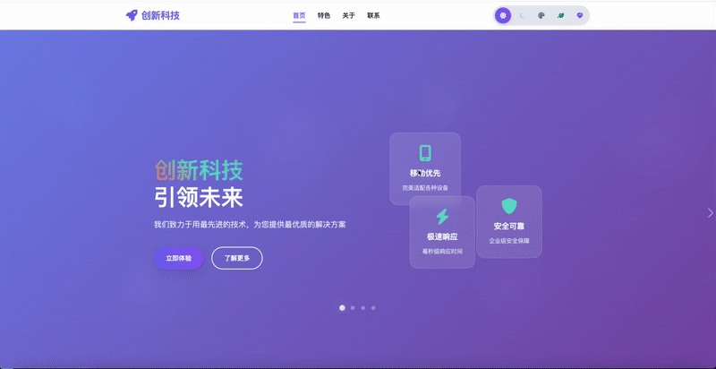

# H5 官网模板

这是一个现代化的 H5 官网模板，采用模块化架构设计，便于维护和扩展。

预览链接：https://yehanliang.github.io/websiteTemplate/

预览效果：

<p align="center">
  
</p>

## 📁 文件结构

```
h5Leaflet/
├── index.html                 # 主页面文件
├── README.md                  # 说明文档
├── config/                    # 配置文件目录
│   └── settings.js            # 网站配置（主题、导航、Swiper等）
├── data/                      # 数据文件目录
│   └── content.js             # 网站内容数据（轮播内容、特色功能等）
├── assets/                    # 静态资源目录
│   ├── css/                   # 样式文件目录
│   │   ├── variables.css      # CSS变量和主题定义
│   │   ├── base.css          # 基础样式和重置
│   │   ├── navigation.css     # 导航栏样式
│   │   ├── hero.css          # 首页横幅样式
│   │   ├── sections.css      # 各页面区块样式
│   │   └── responsive.css    # 响应式设计
│   ├── js/                    # JavaScript文件目录
│   │   ├── core.js           # 核心功能模块
│   │   ├── theme.js          # 主题管理模块
│   │   ├── navigation.js     # 导航管理模块
│   │   ├── swiper.js         # 轮播管理模块
│   │   ├── form.js           # 表单管理模块
│   │   └── main.js           # 主应用入口
│   ├── images/                # 图片资源目录
│   └── fonts/                 # 字体资源目录
└── components/                # 组件目录（预留）
```

## 🚀 快速开始

1. 打开 `index.html` 文件
2. 所有功能都已模块化，便于维护和扩展

## 🎨 功能特性

### 核心功能

- ✅ 响应式设计（移动端优先）
- ✅ 5 种预设主题（浅色、深色、蓝色、绿色、紫色）
- ✅ 双导航栏模式（顶部导航栏 + 左侧侧边栏）
- ✅ 首页轮播功能（Swiper.js）
- ✅ 平滑滚动和动画效果
- ✅ 表单验证和提交
- ✅ 移动端优化

### 模块化架构

- ✅ 配置与内容分离
- ✅ CSS 模块化拆分
- ✅ JavaScript 类化设计
- ✅ 易于维护和扩展

## 📝 配置说明

### 网站配置 (`config/settings.js`)

```javascript
const CONFIG = {
  site: {
    name: "创新科技",
    title: "创新科技 - 引领未来",
    // ... 其他配置
  },
  themes: {
    light: { name: "浅色", color: "#6366f1" },
    // ... 其他主题
  },
  navigation: {
    defaultMode: "top", // top | sidebar
    sections: ["home", "features", "about", "contact"],
  },
  swiper: {
    autoplay: { delay: 5000 },
    speed: 800,
    effect: "fade",
  },
};
```

### 内容数据 (`data/content.js`)

```javascript
const CONTENT = {
  heroSlides: [
    {
      title: "创新科技",
      subtitle: "引领未来",
      description: "我们致力于用最先进的技术...",
      // ... 其他内容
    },
  ],
  features: [
    {
      icon: "fas fa-cog",
      title: "智能配置",
      description: "一键配置，智能优化...",
    },
  ],
};
```

## 🛠️ 开发指南

### 添加新主题

1. 在 `config/settings.js` 中添加主题配置：

```javascript
themes: {
  // ... 现有主题
  orange: {
    name: "橙色",
    color: "#f97316"
  }
}
```

2. 在 `assets/css/variables.css` 中添加主题变量：

```css
[data-theme="orange"] {
  --primary-color: #f97316;
  /* ... 其他变量 */
}
```

3. 在 HTML 中添加主题按钮：

```html
<button class="theme-btn" data-theme="orange" title="橙色主题">
  <i class="fas fa-sun"></i>
</button>
```

### 添加新页面区块

1. 在 `data/content.js` 中添加内容数据
2. 在 `assets/css/sections.css` 中添加样式
3. 在 `assets/js/main.js` 中添加初始化逻辑

### 修改轮播内容

1. 编辑 `data/content.js` 中的 `heroSlides` 数组
2. 页面会自动重新生成轮播内容

### 自定义样式

- **主题变量**: 编辑 `assets/css/variables.css`
- **基础样式**: 编辑 `assets/css/base.css`
- **组件样式**: 编辑对应的 CSS 模块文件

## 📱 移动端适配

- 响应式断点：480px, 768px, 1024px
- 触摸优化：防止双击缩放、触摸反馈
- 视口适配：动态计算视口高度
- 性能优化：被动事件监听、懒加载

## 🔧 技术栈

- **HTML5**: 语义化标签
- **CSS3**: 变量、Grid、Flexbox、动画
- **JavaScript ES6+**: 类、模块、箭头函数
- **Swiper.js**: 轮播组件
- **Font Awesome**: 图标库
- **Google Fonts**: 字体库

## 📦 部署说明

1. 将所有文件上传到 Web 服务器
2. 确保所有资源路径正确
3. 建议使用 HTTPS 协议
4. 配置适当的缓存策略

## 🤝 贡献指南

1. Fork 项目
2. 创建功能分支
3. 提交更改
4. 发起 Pull Request

## 📞 联系方式

如有问题或建议，请通过以下方式联系：

- **电话**: 15770595461
- **微信**: yirenkaifaju

---

**注意**: 本模板采用模块化架构设计，提供了更好的代码组织和维护性，适合各种规模的项目开发。
# websiteTemplate
